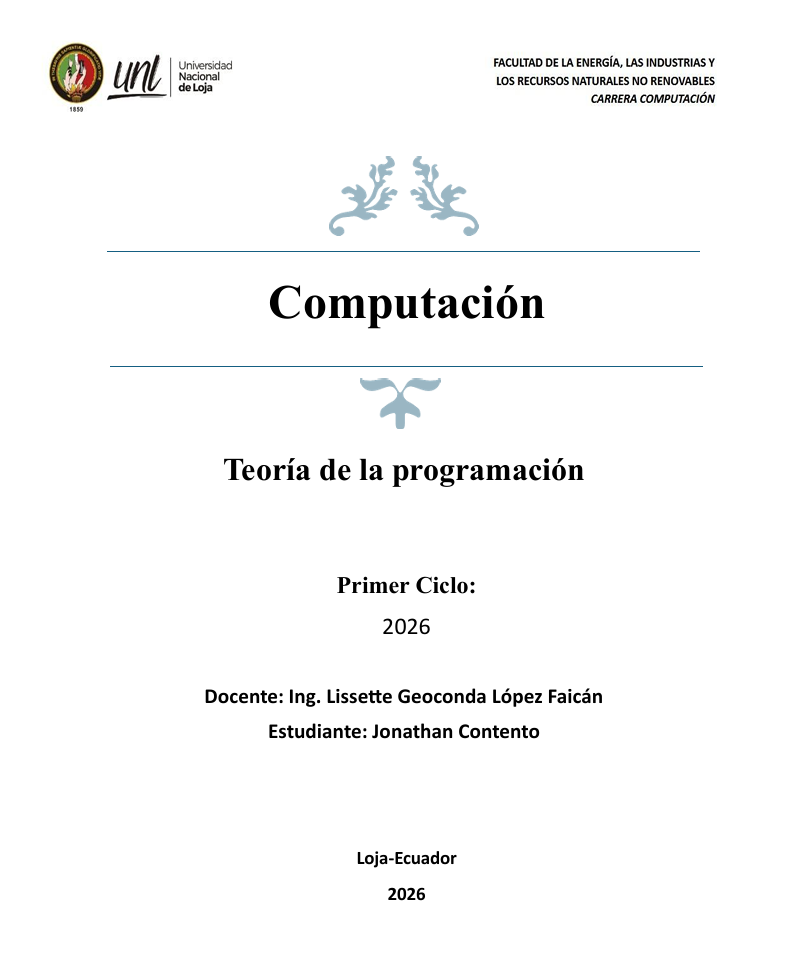
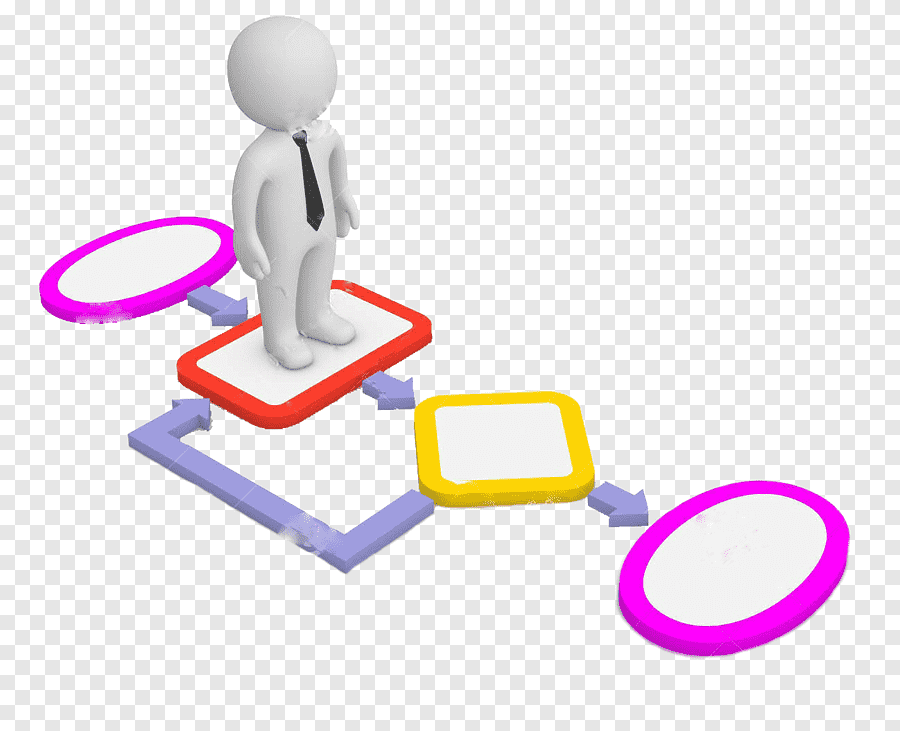
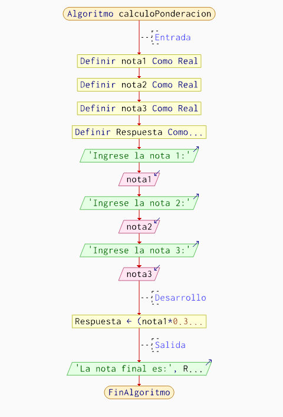
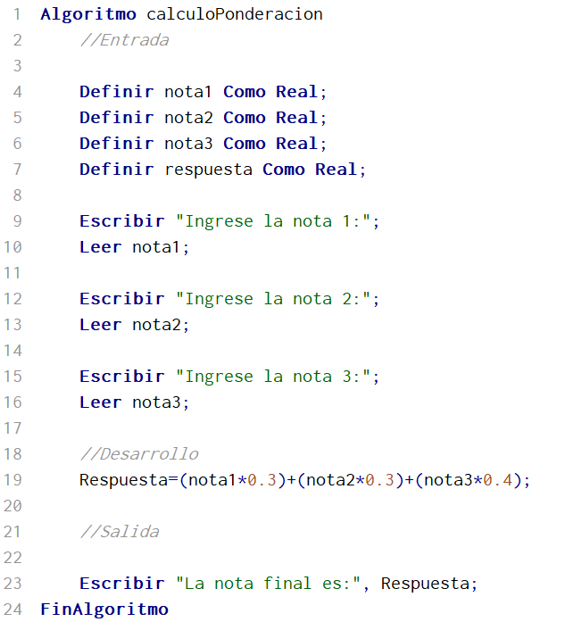
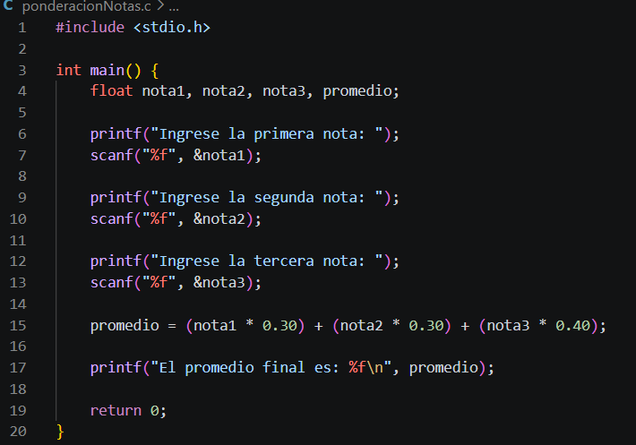

# Portafolio Digital de Aprendizaje – Teoría de la Programación

## Unidad 1

### Contenidos

**🔹 Algoritmo**  
Un algoritmo es una secuencia de pasos lógicamente ordenados y finitos que dan solución a un problema determinado.

**🔹 Pseudocódigo**  
Son instrucciones escritas bajo cierta estructura y reglas que inducirá al alumno hacia los lenguajes de programación,
utiliza símbolos y describe las instrucciones que debe seguir el algoritmo.

**🔹 Diagrama de flujo**  
Es una epresentación gráfica de un algoritmo mediante símbolos y flechas que indican el flujo del proceso.

**🔹 Prueba de escritorio**  
Simulación manual del algoritmo para verificar su correcto funcionamiento.

**🔹 Lenguajes de programación**  
Los lenguajes de programación son formas de comunicarnos con la computadora para decirle qué hacer. Funcionan como un idioma que la máquina entiende, y con ellos se escriben instrucciones llamadas código. Gracias a estos lenguajes, se pueden crear programas, aplicaciones, páginas web y juegos. Algunos ejemplos son C.

**🔹 Programación por bloques**
La programación por bloques es una forma sencilla de programar en la que se usan bloques visuales en lugar de escribir código. Estos bloques representan instrucciones y se encajan como piezas de un rompecabezas para decirle a la computadora qué hacer. Es más fácil de aprender porque evita errores de escritura y ayuda a entender la lógica de la programación. Se usa mucho en programas educativos y para principiantes

---

###  Ejercicio Secuencial

#### Planteamiento del problema

Un alumno necesita calcular el promedio final de sus tres notas.  
Cada nota tiene una ponderación diferente:  
- Primera nota: 30%  
- Segunda nota: 30%  
- Tercera nota: 40%  

Se desea obtener el promedio final ponderado.

---

#### Análisis del problema

- **Entrada:** nota1, nota2, nota3  
- **Proceso:**  
  promedio = (nota1 * 0.30) + (nota2 * 0.30) + (nota3 * 0.40)  
- **Salida:** Promedio Final

---

#### Diseño del algoritmo
**Diagrama de Flujo:**

**Pseudocódigo:**

**Codificación:**

#### Validación (Prueba de escritorio)

| Nota 1 | Nota 2 | Nota 3 |                       Cálculo                        | Promedio |
| ------ | ------ | ------ | ---------------------------------------------------- | -------- |
| 8      | 9      | 10     | (8×0.30=2.4) + (9×0.30=2.7) + (10×0.40=4.0) = 9.1    | 9.1      |
| 7      | 8      | 9      | (7×0.30=2.1) + (8×0.30=2.4) + (9×0.40=3.6) = 8.1     | 8.1      |
| 10     | 10     | 10     | (10×0.30=3.0) + (10×0.30=3.0) + (10×0.40=4.0) = 10.0 | 10       |

### Principales dificultades y reflexión crítica en la aplicación de los contenidos

Durante el desarrollo de la unidad se presentaron diversas dificultades, como la comprensión inicial de algunos de los conceptos básicos, ademas de que en un inicio, resultó complicado diferenciar entre la forma teórica (pseudocódigo) y la forma práctica (código en lenguaje C).
Otra dificultad fue la correcta interpretación de los problemas, ya que no siempre era sencillo identificar las entradas, procesos y salidas. Esto ocasionaba errores al momento de diseñar el algoritmo o realizar la prueba de escritorio.
Sin embargo, a medida que se avanzó con la práctica, se logró mejorar la capacidad de análisis y la organización lógica de las soluciones. El uso de ejercicios secuenciales permitió comprender mejor la estructura básica de un programa y la importancia de seguir un orden adecuado en las instrucciones.

Como reflexión, estos contenidos son importantes porque son la base de la programación. Aprender a organizar un algoritmo antes de programar ayuda a hacer programas más claros y ordenados. Además, el uso de herramientas digitales y la inteligencia artificial ayudó a entender mejor los temas y resolver dudas.

---
##  Bibliografía

[1] Material de clase de la asignatura Teoría de la Programación, proporcionado por el docente, 2026.

[2] Apuntes personales del estudiante, elaborados durante el desarrollo de la asignatura, 2026.

[3] :contentReference[oaicite:0]{index=0}, OpenAI, utilizado como herramienta de apoyo para la comprensión de contenidos y redacción, 2026.

---
## Declaración de uso de IA generativa

Para la elaboración de este portafolio se utilizó inteligencia artificial como herramienta de apoyo, específicamente ChatGPT, con el objetivo de reforzar la comprensión de los contenidos, mejorar la redacción y guiar la estructura del trabajo.

El uso de esta herramienta fue complementario al aprendizaje propio, asegurando la comprensión de cada tema desarrollado.

